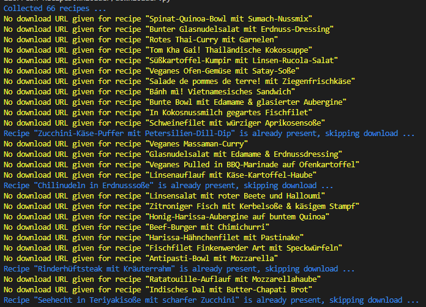
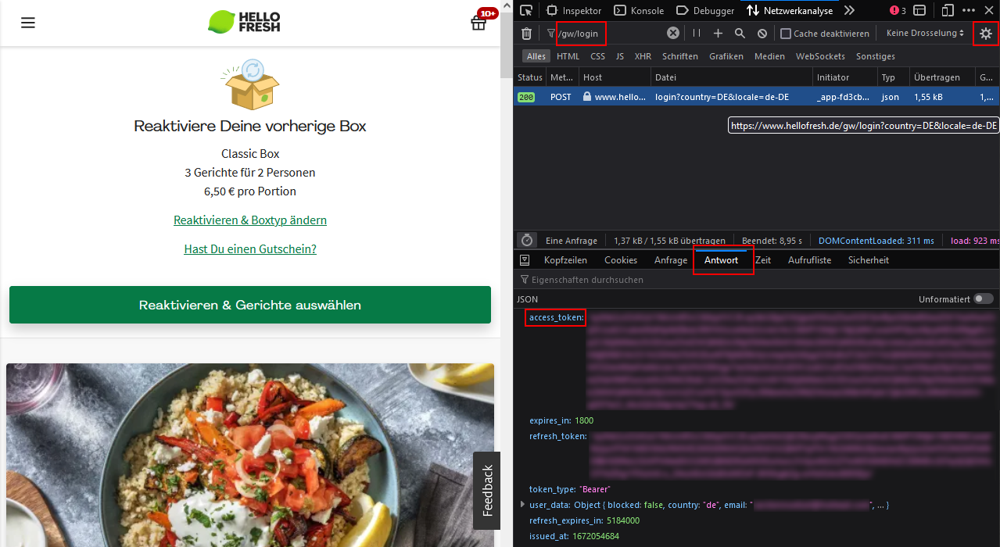

# HelloFresh Recipe Downloader
This small project written in Python allows you to download all the recipes of your recently received [HelloFresh](https://www.hellofresh.de) deliveries.

I've written this project because between the years 2020 and 2022 I've ordered a lot from HelloFresh and I wanted to digitalize all my recipes, without manually scanning or downloading them.
I started scanning the recipes, but wasn't satisfied with the quality of the scans.

## How does it work?
The script accesses the HelloFresh-API and requests your past deliveries using your provided JWT `access_token`. 
For each collected recipe ID a request is done against an other API endpoint to retrieve the `cardLink` attribute which contains the link to the downloadable recipe card.
If the recipe has already been downloaded the recipe is skipped and the next ID is processed.

## How can I use it?
If want to use this project please follow these steps:

 1. Clone the project.
 2. Run `pip install -r requirements.txt` to install necessary dependencies.
 3. Create a `.credentials` file in the root directory.
 4. Login on `https://www.hellofresh.de` and copy the `access_token` into the `.credentials` file.
 5. Run the script.
    1. Either use `python ./downloader.py` to download exactly the recipes from your history.
    2. Or execute `python ./downloader.py --similaritySearch` to search for Recipe with **same name and ingredients** in case that the recipe from your history couldn't be downloaded.
 6. The script should log download result into the console as shown below.

The login is mandatory to access your recent deliveries.

## How do I get the access token?
1. Go to the [HelloFresh-Login](https://www.hellofresh.de/login) page.
2. Open the developer console (hit F12 button on Windows with Firefox) and switch to the network analysis tab.
3. Filter for `/gw/login` and ensure that the logs aren't emptied by checking "Do not empty logs" under the little gear icon in the top right corner.
4. Login with your credentials and the response of the request should display the `access_token`.
5. Copy the content of `access_token` to the `.credentials` file.

## Notes
It seems that HelloFresh doesn't supply downloadable recipe cards for every recipe. This might be a wanted by HelloFresh to avoid people from downloading all their recipes.

So it might be necessary to run this little script more than once in different weeks.